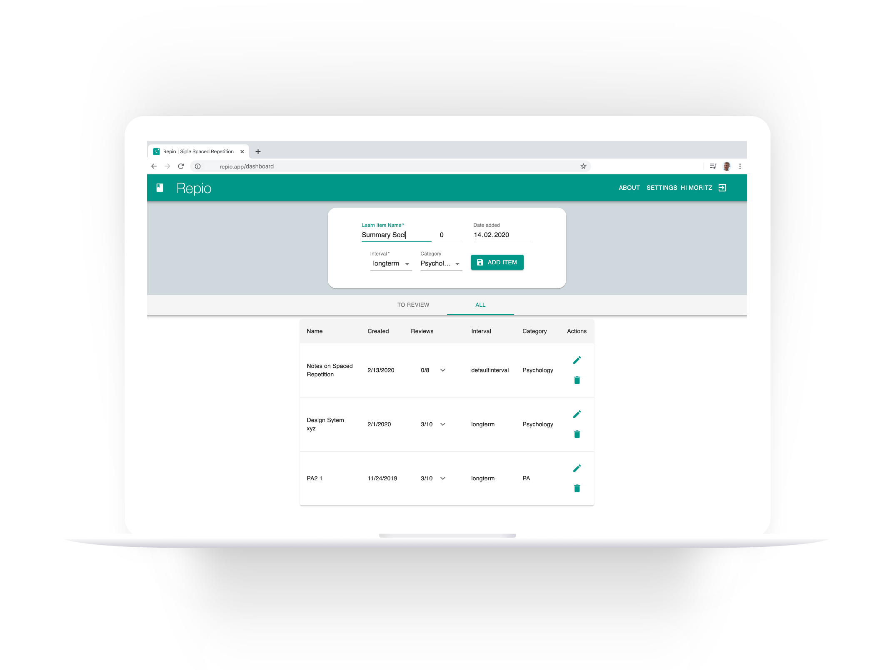

# Repio

a simple spaced repetition reminder app

<div align="center">

[](https://spectrum.chat)

### The simplest spaced repetition reminder app.

</div>

This is the main monorepo codebase of [Repio](https://repio.app). Every single line of code that's not packaged into a reusable library is in this repository.

## What is Repio?

Repio is he most simple spaced repetition App you have ever seen. Completely detached from the lessons, notes, videos and other forms of knowledge you want to learn.

### Why and what to learn?

[Spaced repetition](https://en.wikipedia.org/wiki/Spaced_repetition#:~:text=Spaced%20repetition%20is%20an%20evidence,exploit%20the%20psychological%20spacing%20effect.) is typically studied through the use of memorizing facts. Traditionally speaking, it has not been applied to fields that required some manipulation or thought beyond simple factual/semantic information. A more recent study has shown that spaced repetition can benefit tasks such as solving math problems.

### Functionality

RemNote lets you create items, and intervals. Items could be book summaries code bases, notes, videos etc. Intervals are the spaced repetition interval which determine the interval your items will be scheduled for review. You are then reminded to review/study those items and they appear in the "TO REVIEW" section. In this view you can then increment the number of reviews by clicking the checkmark icon on the right.

The default Intervals (in days) are:

```
"Longterm": [7, 14, 24, 35, 49, 84, 140, 231, 371]
"Shortterm": [3, 7, 14, 28, 42, 56, 98, 196]
```

You can also create categories to organize your items. We recommend to schedule blocks of time to review items batched by one category to maintain a low [context switching cost](https://www.psychologytoday.com/us/blog/brain-wise/201209/the-true-cost-multi-tasking). You can create new intervals and categories in the SETTING section.

### Demo

You can view a short demo of the app [here](https://www.youtube.com/watch?v=lfoa3N4uVyc)

<br>
<br>

## Installation instructions

### Install dependencies

```bash
npm install
npm client-install
```

### Create config.env

```
MONGO_URI='...'
SECRET_KEY='...'
```

### Run Server

```bash
npm run dev     # Express & React :3000 & :5000
npm run server  # Express API Only :5000
npm run client  # React Client Only :3000
```

<br>

## Codebase

### Technologies and used Libraries

With the ground rules out of the way, let's talk about the coarse architecture of this mono repo:

- **Full-stack JavaScript**: We use Node.js to power our servers, and React to power our frontend apps. Almost all of the code you'll touch in this codebase will be JavaScript.

Here is a list of all the big technologies we use:

#### Frontend

- **React**: Frontend Framework
- **material-ui**: Frontend UI Libraries

others: **react-swipeable-views**, **react-transition-group**, **axios**, **uuid** (Alert management)

#### Backend/Globally

- **Express**: Backend Framework
- **MongoDB**: Data storage

- **jsonwebtoken**: Authentication
- **bcryptjs**: Authentication

those tools and technologies where chooses because in my research they turned out to be the most robust, supported and actively used.

#### Client Folder structure

the frontend is structured in the components and the context which entails the state management. Each resource has their own -State, -Context and -Reducer file. The context file utilizes Reacts [useContext](https://reactjs.org/docs/hooks-reference.html#usecontext) hook to create a global state for that resource that is accessed in the components if needed.

```
-- src
    |       |-- App.css
    |       |-- App.js
    |       |-- index.js
    |       |-- components
    |       |   |-- auth
    |       |   |   |-- Login.js
    |       |   |   |-- Register.js
    |       |   |-- items
    |       |   |   |-- AllList.js
    |       |   |   |-- ItemFilter.js
    |       |   |   |-- ItemForm.js
    |       |   |   |-- Items.js
    |       |   |   |-- ToReviewList.js
    |       |   |-- layout
    |       |   |   |-- Alerts.js
    |       |   |   |-- Navbar.js
    |       |   |   |-- Spinner.js
    |       |   |   |-- spinner.gif
    |       |   |-- pages
    |       |   |   |-- About.js
    |       |   |   |-- Home.js
    |       |   |   |-- LandingPage.js
    |       |   |   |-- Macbookwhite.png
    |       |   |   |-- Settings.js
    |       |   |   |-- repioexplaination.png
    |       |   |-- routing
    |       |       |-- PrivateRoute.js
    |       |-- context
    |       |   |-- types.js
    |       |   |-- alert
    |       |   |   |-- AlertState.js
    |       |   |   |-- alertContext.js
    |       |   |   |-- alertReducer.js
    |       |   |-- auth
    |       |   |   |-- AuthState.js
    |       |   |   |-- authContext.js
    |       |   |   |-- authReducer.js
    |       |   |-- interval
    |       |   |   |-- IntervalState.js
    |       |   |   |-- intervalContext.js
    |       |   |   |-- intervalReducer.js
    |       |   |-- item
    |       |       |-- ItemState.js
    |       |       |-- itemContext.js
    |       |       |-- itemReducer.js
    |       |-- utils
    |           |-- setAuthToken.js
```

### API/Backend

#### Resources

All routes are private and need a token in the header of the request, except the 'POST api/auth'-route to login and the 'POST api/users'-route to create an account.

During signing up there are created 4 default categories and 2 default intervals for the the. His chosen password is encrypted with bcrypt.

The token is send after successful logging in via the public 'POST api/auth'-route.

- auth.js
- intervals.js
- items.js
- users.js
